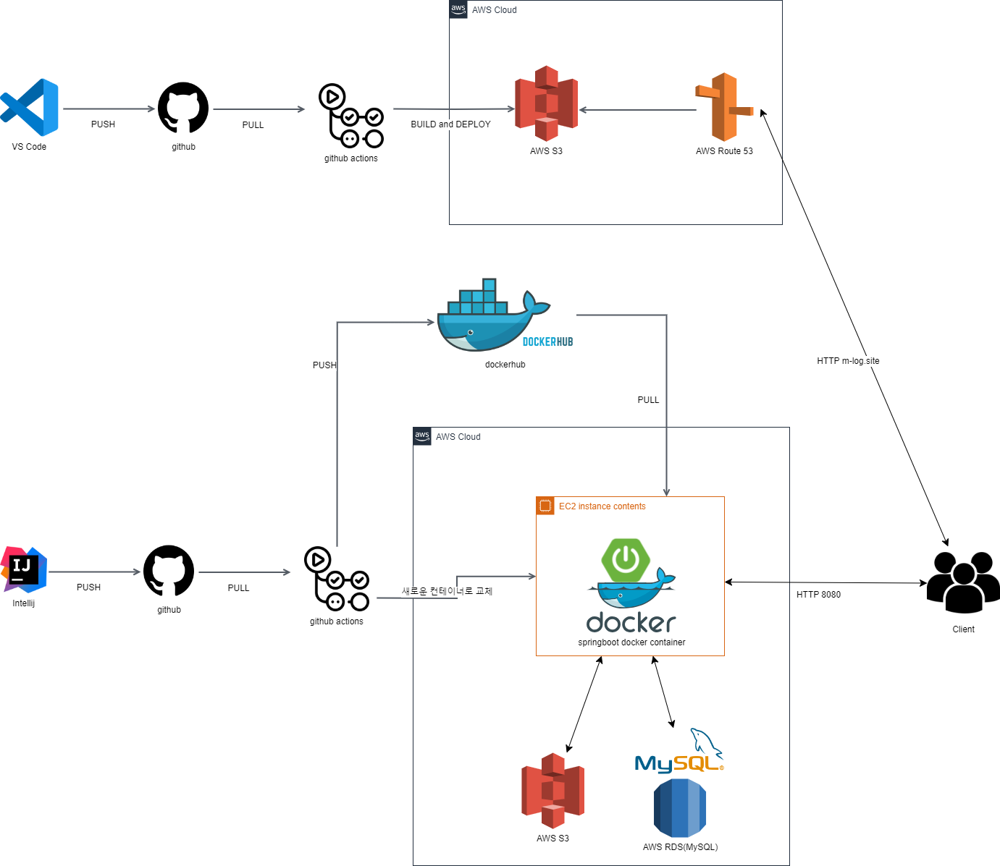
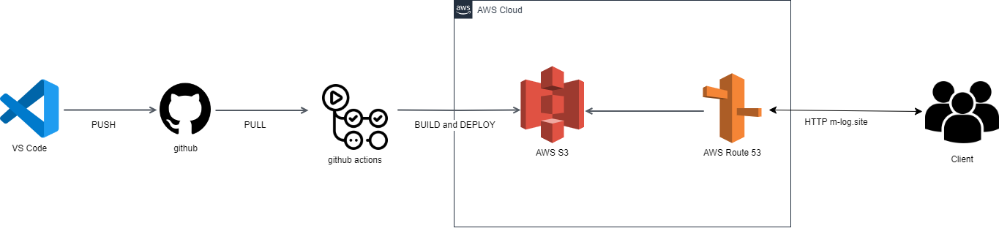
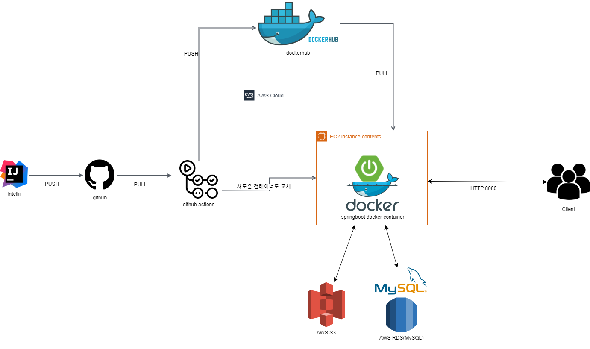
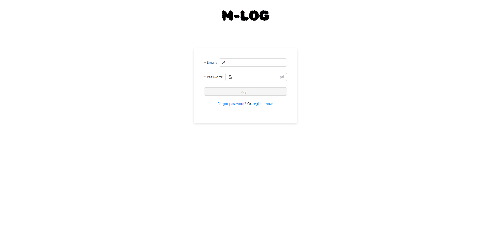

# 🌏 M-LOG ; Map에 Log를 기록하다 🌎

 

## 🎖️ SSAFY 11기 관통 프로젝트 `우수상` 수상 🎖️

 

## 🎤 소개
- 지도에 마커를 통해 여행을 기록하는 서비스

## 🗓️ 기간
2024.04 ~ 2024.05

## 🧑‍💻 팀원

<table border=""4 width="100%">
     <td align="center"><a href="http://github.com/hellomatia">

   <td align="center"><a href="https://github.com/hyeonhakyi">
  </tr>
    <tr>
     <td align="center"><a href="http://github.com/hellomaita">이지표</td>
	 <td align="center"><a href="https://github.com/hyeonhakyi">이학현</td>
</table>

## 🚀 핵심 기능
- CI/CD 체계 구축
- 각종 검색 기능 구현
- 사용자 이메일을 통해 비밀번호 제 설정 기능 구현
- Spring rest docs로 자동 api 문서 생성 기능 구현

 

## 🛠️ 아키택처 🛠️
### 전체 아키택처

### 프런트 아키택처

### 백엔드 아키택처

 

## 🚩 구현 화면

### 로그인/로그아웃

### 비밀번호 재설정

### 위치 검색

### 관광지 검색

### 내 여행 기록 리스트

### 내 여행 기록 추가
